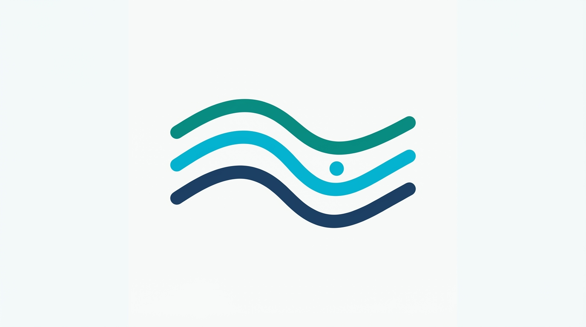

# Fleuve Go — documentation

Welcome. These pages supplement the [project README](../README.md) with structured guides. **Python Fleuve** remains the behavioral reference for ordering, offsets, and recovery; this port targets **wire compatibility** (schema, HTTP, NATS shapes, config keys).

---

## Start here

| Document | Audience | Contents |
|----------|----------|----------|
| [**Getting started**](./getting-started.md) | Everyone | Prerequisites, migrations, env vars, run stack, first API calls |
| [**Architecture**](./architecture.md) | Integrators | Diagrams, write path vs read path, packages at a glance |
| [**HTTP API**](./http-api.md) | Frontend / automation | Command gateway + admin UI JSON routes |

---

## Configuration & operations

| Document | Contents |
|----------|----------|
| [**Configuration**](./configuration.md) | `fleuve.toml`, `FLEUVE_*`, UI flags, OpenTelemetry |
| [**Operations**](./operations.md) | Deploy order, migrations, CI, metrics |
| [**NATS gateway commands**](./nats-gateway-commands.md) | Optional request/reply from gateway to runner (`gateway_commands_via_nats`) |
| [**Packages**](./packages.md) | `pkg/*` responsibilities |
| [**Bundled UI**](./ui-embed.md) | `pkg/uiembed`, `pkg/uibackend`, vendoring script |

---

## Python Fleuve

| Document | Contents |
|----------|----------|
| [**INTEGRATION**](./INTEGRATION.md) | Same database as Python, schema checks, cutover (no mixed runners) |
| [**Behavior & parity**](./behavior-and-python-parity.md) | Ordering, acks, offsets, recovery, how to validate |
| [**Python ↔ Go checklist**](./python-go-parity-checklist.md) | Engine + UI parity matrix (repo, stream, gateway, UI) |

---

## Examples in the repo

- [`examples/counter`](../examples/counter/) — PG-backed counter without HTTP
- [`examples/order`](../examples/order/) — larger sample (see [examples/README.md](../examples/README.md))

---

## Development

| Document | Contents |
|----------|----------|
| [**Development**](./development.md) | Tests, vendoring UI, module path, doc maintenance |

---

## Contributing to docs

- Prefer **accurate, minimal** examples that compile against the current module path `github.com/doomervibe/fleuve-go`.
- When behavior matches Python, point to **behavior-and-python-parity.md** instead of duplicating long semantics here.
