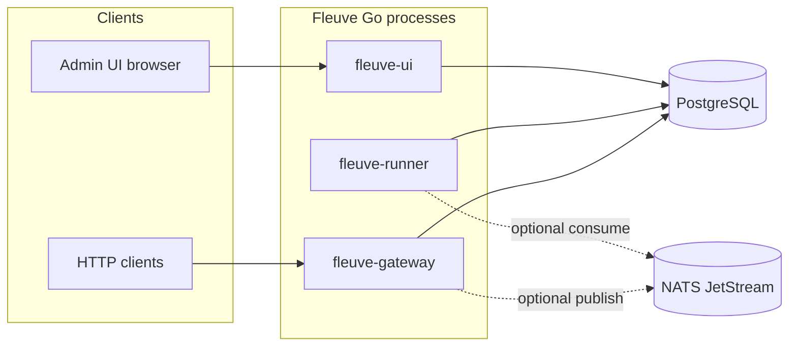
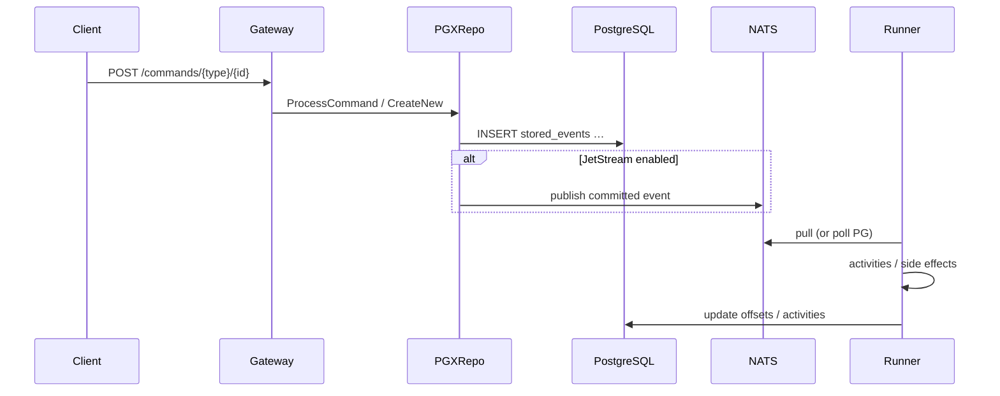

# Architecture

Fleuve Go separates **command acceptance** (gateway), **durability** (PostgreSQL), **stream processing** (runner + optional NATS), and **observability** (admin UI, metrics, traces).

---

## System context

- **Gateway** appends events and updates workflow state inside transactions; with JetStream enabled it may publish after commit.  
- **Runner** advances consumer position using rules described in [behavior-and-python-parity.md](./behavior-and-python-parity.md).  
- **UI** is read-mostly over SQL (lists workflows, events, activities, delays, stats).

---

## Command and event path

**Per-workflow serialization** is enforced in the repository layer so concurrent global processing does not reorder commands for a single `workflow_id`.

---

## Shipped binaries

| Binary | Role |
|--------|------|
| `fleuve-gateway` | REST command API; registers **CounterWorkflow** via [`pkg/fleuvecmd`](../pkg/fleuvecmd/register.go) |
| `fleuve-runner` | Consumes events (NATS or PG reader), runs [`pkg/actions`](../pkg/actions) executor with DB-backed activity rows |
| `fleuve-ui` | Reference binary from [`examples/ui_server`](../examples/ui_server); libraries [`pkg/uibackend`](../pkg/uibackend/handler.go) + [`pkg/uiembed`](../pkg/uiembed/embed.go) |

Extend **`cmd/gateway`** and **`cmd/runner`** (or your own `main`) to register additional workflow types.

---

## Package map (high level)

See [packages.md](./packages.md) for a fuller table. Core idea:

| Area | Packages |
|------|----------|
| Domain | `pkg/model` |
| Persistence | `pkg/repo`, `pkg/postgres` |
| Ingress | `pkg/gateway` |
| Stream | `pkg/stream` (PG reader, NATS reader, JetStream publisher) |
| Side effects | `pkg/actions` |
| Runner loop | `pkg/runner` |
| Admin API | `pkg/uibackend`, `pkg/uiembed` |
| Cross-cutting | `pkg/config`, `pkg/tracing`, `pkg/metrics` |

---

## What is not drawn above

- **Delays / cron** — rows in `delay_schedules`, scheduler logic in `pkg/delay` (align with Python for edge cases).  
- **Snapshots / truncation** — optional repo options and `pkg/truncation` (when enabled).  
- **Scaling / partitions** — `pkg/scaling` for partition-oriented operations.  

For **semantic** guarantees (ordering, ack timing, offset keys), treat [behavior-and-python-parity.md](./behavior-and-python-parity.md) as canonical.
